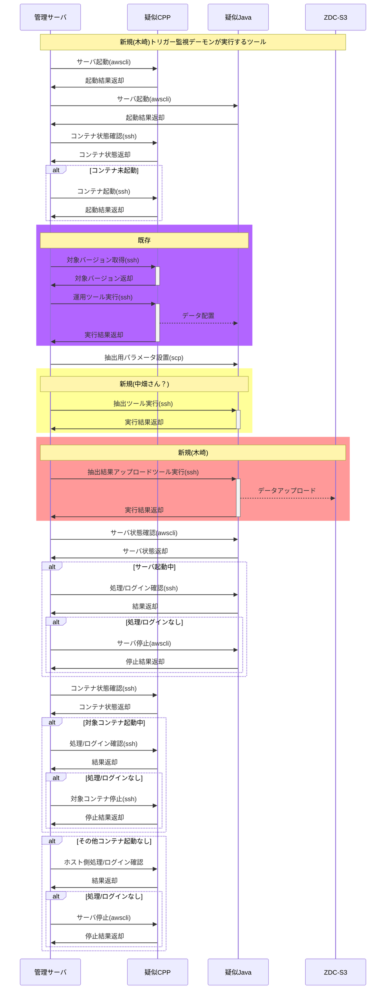

# システム自動化

## 検証

### 各種サーバ連携

#### トリガー監視デーモン

- 実行するツールは同期処理とする。
- 実行するツールは戻り値を返却する。
  - エラーが発生した場合はどのタイミングで発生したかわかるよう戻り値を定義する。
    - エラーの場合の自動化DB登録はツール、またはトリガー側で行うかは未定。
- 実行ツールが使用するパラメータは環境変数に設定しておく。

#### シーケンス

