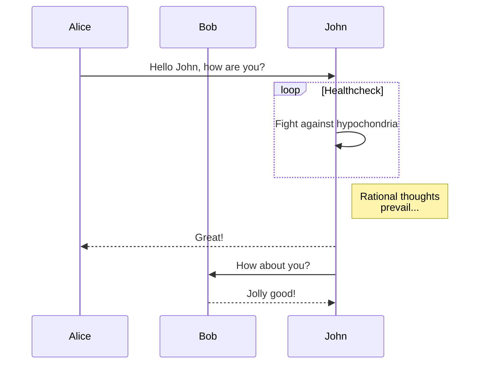
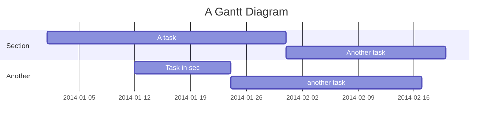

%title test
%date 2019/10/21

test
==============

test2
----------

# sample
<!--- test comment -->  

<script src="https://cdnjs.cloudflare.com/ajax/libs/mermaid/8.0.0/mermaid.min.js"></script>


~~~mermaid
sequenceDiagram
    participant Alice
    participant Bob
    Alice->>John: Hello John, how are you?
~~~


practice for github




- test
  ```python
  import test
  ```
  
  

```python
import test
```

<!--- test comment -->


1. test
1. test  
    あいうえうお  
    <!--- test comment -->  
    テスト


    あいうえうお2
    <!--- test comment -->  
    テスト


    あいうえうお3  
    <!--- test comment -->
    テスト


    あいうえうお4
    <!--- test comment -->
    テスト
1. test

```python :filename
import test
```


```python "10"
import test
```

<!-- attach: test -->

| test | test2 |test |
|---|---|---|
|0|1|2|

test  

```python
test
```  

test

aiueo





```
test
```
